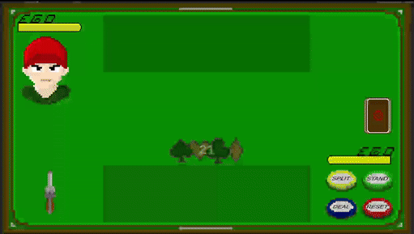
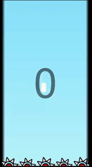

<h1>Hi, I'm Kamil!  <a href="https://drive.google.com/drive/folders/1BMz-kRYjAutS9GPaQSJWqIoJDihdDU0V?usp=drive_link">I just like to make stuff</a>

<h2>👨‍💻 Projects:</h2>

- <b> Mixed Reality </b>
  - [Mixed Reality Training Application](https://github.com/FushiGameDev/Mixed-Reality-Training-App) 🥽
- <b>Unity Games</b>
  - [Comedy Attic](https://github.com/FushiGameDev/ComedyAttic) 🎭
  - [Football Story](https://github.com/FushiGameDev/FootballStory) ⚽
  - [DINO](https://github.com/FushiGameDev/DINO/tree/main) 🐱‍🐉

<h2>  🔜Ongoing projects </h2> 

  - <b> Card Game </b> - roulette card game

  

  - <b> Mobile Dash </b> - mobile arcade game  
  
  

  - <b> Let me tell you something </b> - game to develop solid dialog system, with open world and some fun storytelling   

  

<h2> Some IRL Projects ;)</h2>  
  
  - <b> Rick's Workshop Portal Gun </b> 🔫  
    One time I needed to prepare a costume of Rick. I decided to create a workshop gun simillar to Rick's Portal gun. It shoots with anything you put there but I just used beer caps. It was made with ESP8266 board, leftovers from renovation, glue gun and glass. Made it in 2 days and it was pretty fun to get back to old hobby.
    

    
    

    
  - <b> 1v1 Card Game </b>🃏

<h2> 🤳 Connect with me!</h2>

[][youtube]
[][linkedin]

[youtube]: https://www.youtube.com/@Fushi-GameDev
[linkedin]: https://www.linkedin.com/in/kamil-borys-526b21263/

